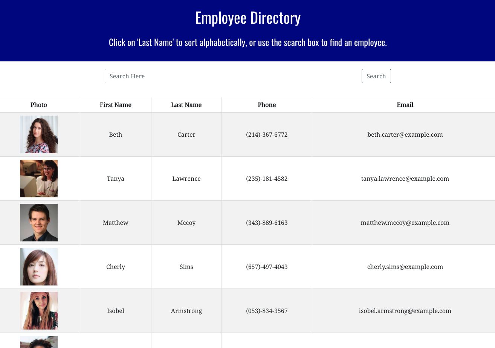

For this assignment, I created a employee directory with React. This assignment required me to break up the application's UI into components, manage component state, and respond to user events.

## User Story

* The user wanted to be able to view the entire employee directory at once so that they have quick access to their information.

## Business Context

An employee or manager would benefit greatly from being able to view non-sensitive data about other employees. It would be particularly helpful to be able to filter employees by name.

## Acceptance Criteria

Given a table of random users, when the user loads the page, a table of employees renders. 

The user is able to:

  * Sort the table by at least one category

  * Filter the users by at least one property.

Here's what it looks like:

